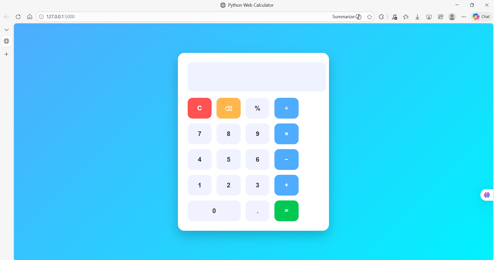

# Python Web Calculator

## 📌 Project Overview

The **Python Web Calculator** is a simple web-based calculator application built using **Python Flask** for the backend and **HTML, CSS, and JavaScript** for the frontend.

This project demonstrates how Python can be integrated with modern web technologies to create an interactive web application. The calculator allows users to perform basic arithmetic operations through an intuitive graphical interface directly in the browser.

The project is suitable for beginners who want to understand how backend frameworks like Flask interact with frontend technologies to create dynamic web applications.

---

## 🚀 Features

* Perform basic arithmetic operations:

  * Addition
  * Subtraction
  * Multiplication
  * Division
* Interactive calculator button interface
* Real-time calculation results
* Clean and simple user interface
* Lightweight Flask backend
* Easy to run locally
* Organized project structure

---

## 🛠 Technologies Used

| Technology | Purpose                                     |
| ---------- | ------------------------------------------- |
| Python     | Backend programming language                |
| Flask      | Web framework used to build the application |
| HTML5      | Structure of the web page                   |
| CSS3       | Styling and layout                          |
| JavaScript | Calculator logic and interactivity          |

---

## 📂 Project Structure

```
python-web-calculator
│
├── app.py
├── README.md
├── templates
│     └── index.html
└── static
      └── style.css
```

### File Explanation

**app.py**
The main Python file that runs the Flask web server and loads the HTML page.

**templates/index.html**
Contains the calculator interface and structure.

**static/style.css**
Provides styling and layout for the calculator UI.

**README.md**
Project documentation and instructions.

---

## ⚙️ Installation and Setup

Follow these steps to run the project on your system.

### 1️⃣ Clone the repository

```
git clone https://github.com/sravya0125/python-web-calculator.git
```

### 2️⃣ Navigate to the project directory

```
cd python-web-calculator
```

### 3️⃣ Install required dependency

```
pip install flask
```

### 4️⃣ Run the application

```
python app.py
```

### 5️⃣ Open in browser

```
http://127.0.0.1:5000
```

You should now see the **calculator interface running locally**.

---

## 📸 Project Preview

(Add your calculator screenshot here)

```

```

---

## 📈 Future Improvements

Possible enhancements for this project include:

* Scientific calculator functions
* Keyboard input support
* Calculation history
* Dark mode UI
* Mobile responsive design
* Deployment to a live server

---

## 💡 Learning Outcomes

Through this project, the following concepts can be learned:

* Basic web application development with Flask
* Integration of backend and frontend technologies
* Handling user input and performing calculations
* Structuring a small web project
* Using Git and GitHub for version control

---

## 👩‍💻 Author

**Sravya**

GitHub:
https://github.com/sravya0125

---

## ⭐ Support

If you found this project helpful, consider giving it a **star ⭐ on GitHub**.
